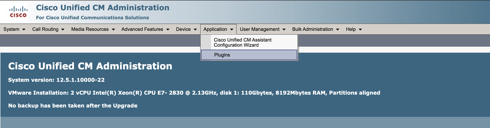
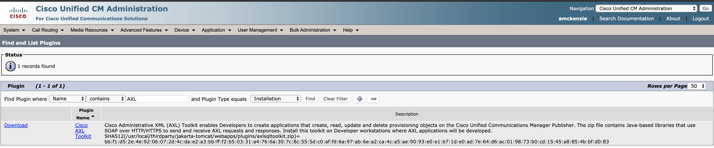
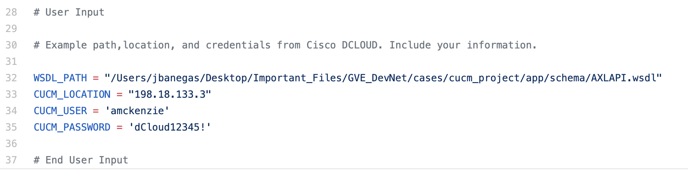
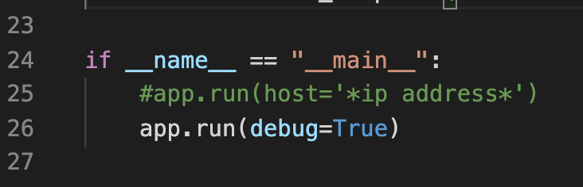
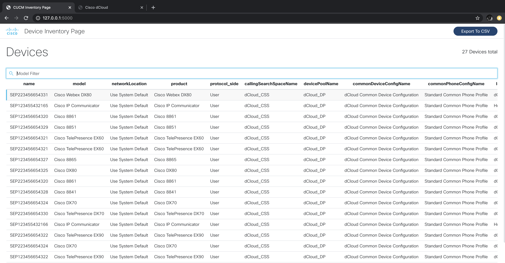

# cucm_phone_inventory
Flask web app that displays several information details about all the phone endpoints from your CUCM environment

In this sample, you will be able to see an example of a front-end and back-end solution that utilizes the Administrative XML Layer (AXL) API and Risport (realtimeservice) API for Cisco Unified Communications Manager with python to view a list of all your phone endpoints.

### Author:
* Jorge Banegas (jbanegas@cisco.com)
*  Feb 2020
***

### Important Notes
* The two test files are include to explore the responses that the api calls returns for the phones
* The serial number will only display for phones that have a routable ip address from which this flask server will be running on.
* The method this script is using, is grabbing the ip address for the phone, and then web scraping the phone's web page to grab the serial numbter.
* If phone does not have an IP address, the serial number will show as "unassigned" and if the ip address is unreachable from the hosted server, the serial number will show as "unaccessible"

### Prerequisites
* Python 3
* AXL CUCM Toolkit Files
* Enable AXL on CUCM (https://www.uplinx.com/cleanup-tool/webhelp/index.htm?page=Enable-AXL-on-CUCM.htm)
* CUCM Admin Credentials or user that has AXL API permissions
* CUCM and this code has to be hosted under the same subnet for the communication to go through

# Setup instructions
1. Go to CUCM admin page and retrieve the AXL toolkit files from your environment.

1a. Click on Applications and then plugins.


1b. Search for AXL and install the AXL toolkit


2. install and clone this repo onto a server that has python3 installed 

3. install and create a virtual environment for your project (https://packaging.python.org/guides/installing-using-pip-and-virtual-environments/)

4. enter the virtual environment by entering the terminal command 
```sh
source (venv name)/bin/activate
```

5. install dependencies by entering the terminal command
```sh
pip3 install -r requirements.txt file
```

6. Edit user_env_default.py and add your CUCM environment and user details


7. After including your information on the user_env_default.py file, enter the terminal command 
```sh
cp user_env_default.py user_env.py
``` 

8. In main.py file, change to the desired ip address that is routable so people within the same network can visit the site.


9. Enter terminal command to start up flask server 
```sh
python3 main.py
``` 

10. If steps are complete and the flask server is up and running, user will be able to visit the page on port 5000 on the ip address that was provided. 

### Screenshots



### API Reference/Documentation (VERY USEFUL TO CHECK OUT!):
* [Original code repo from David Staudt using suds python libary (library being used for this project)] (https://github.com/CiscoDevNet/axl-python-suds-sample)
* [AXL reference (uses different python library zeep)] (https://paultursan.com/2016/04/getting-started-with-python-cucm-axl-api-programming/)
* [Risport reference] (https://www.cisco.com/c/en/us/td/docs/voice_ip_comm/cucm/devguide/7_1_2/AXL_DevGuide/serviceability.html#wp1053792)

## License
Provided under Cisco Sample Code License, for details see [LICENSE](LICENSE)

## Code of Conduct 
Our code of conduct is available [here](CODE_OF_CONDUCT.md)

## Contributing 
See our contributing guidelines [here](CONTRIBUTING.md)

### DISCLAIMER:
<b>Please note:</b> This script is meant for demo purposes only. All tools/ scripts in this repo are released for use "AS IS" without any warranties of any kind, including, but not limited to their installation, use, or performance. Any use of these scripts and tools is at your own risk. There is no guarantee that they have been through thorough testing in a comparable environment and we are not responsible for any damage or data loss incurred with their use.
You are responsible for reviewing and testing any scripts you run thoroughly before use in any non-testing environment.
